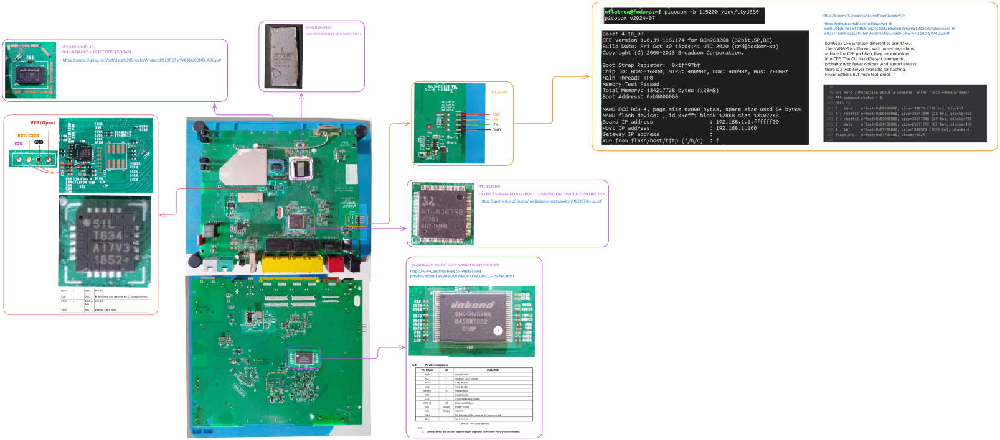

### neufbox-nb6

SFR NB6VAC-FXC Analysis and Reverse Engineering <br>
An attempt to reverse engineer `neufbox-nb6` router, specifically `SFR NB6VAC-FXC` model.

### Tree

```
.
├── firmware
│   ├── _cfe_bcm63xx_03022026.bin.extracted
│   ├── cfe_bcm63xx_03022026.bin.tar.gz
│   ├── docs
│   ├── logs
│   └── scripts
├── hardware
│   ├── docs
│   ├── img
│   └── NB6VC_treadown.webp
├── LICENSE
└── README.md
```

### Firmware

### Hardware

> Model: NB6VAC-FXC-r1



### License

This repository is licensed under the MIT License. See the LICENSE file for details.

### Contributing

Feel free to contribute by submitting a pull request or opening an issue ;)
