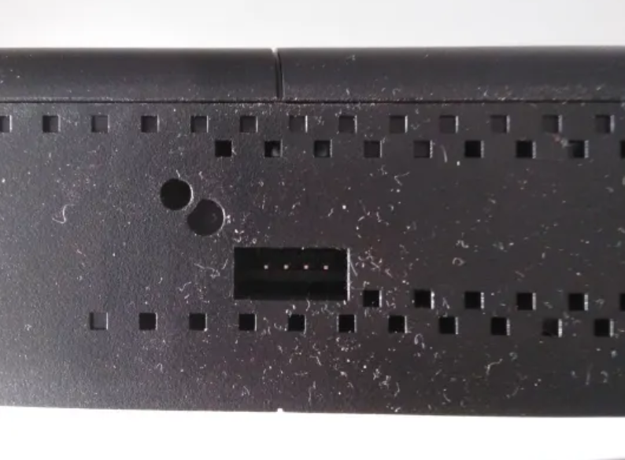
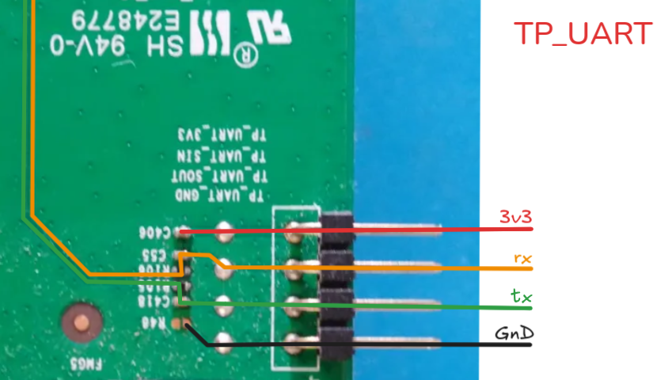

### neufbox-nb6

=======
# neufbox-nb6

SFR NB6VAC-FXC Analysis and Reverse Engineering <br>
An attempt to reverse engineer `neufbox-nb6` router, specifically `SFR NB6VAC-FXC` model.

### Tree

```
.
├── firmware
│   ├── _cfe_bcm63xx_03022026.bin.extracted
│   ├── cfe_bcm63xx_03022026.bin.tar.gz
│   ├── docs
│   ├── logs
│   └── scripts
├── hardware
│   ├── docs
│   ├── img
│   └── NB6VC_treadown.webp
├── LICENSE
└── README.md
```

### Analysis

| Router                | Value                  |
|-----------------------|------------------------|
| Model                 | NB6VAC-FXC-r1          |
| Firmware              | NB6VAC-MAIN-R4.0.44f   |
| Emergency Firmware    | NB6VAC-MAIN-R4.0.44j   |


| Complete Teardown     |
|:---------------------:|
|  |

#### Getting a root shell
| Visible port          | After teardown         |
|:---------------------:|:----------------------:|
|  |  |

Unscrewing the base uncovers four UART connectors (and voids warranty).
Considering pin 1 to be the closest to the power supply cable, pins respectively correspond to:

1. GND      (TP_UART_GND)
2. TX       (TP_UART_SOUT)
3. RX       (TP_UART_SIN)
4. VCC 3V3  (TP_UART_3V3) <= not needed

Plugging those pins to a computer (_via_ a TTL-to-USB convertor like CH340),
we can see what the serial console prints during boot:

```console
$ picocom -b 115200 /dev/ttyUSB90 -g TP_UART_nb6_2101220251416.txt
```

Let's turn the router on and look at it.

* The boot loader is CFE version 1.0.39

```console
CFE version 1.0.39-116.174 for BCM963268 (32bit,SP,BE)
```

* CFE offers an interactive menu when a key is pressed from the serial at startup.

```console
*** Press any key to stop auto run (1 seconds) ***
Auto run second count down: 111
RTL: chip 6000.1000 probed
TX/RX delay set on switch side!
CFE> 

 Port 4 link UP

ccc   
CFE> 
CFE> 
CFE> 
CFE> 
CFE> help
Available commands:

fe                  Erase a selected partition of the flash (use fi to display informations).
fi                  Display informations about the flash partitions.
fb                  Find NAND bad blocks
dn                  Dump NAND contents along with spare area
phy                 Set memory or registers.
sm                  Set memory or registers.
dm                  Dump memory or registers.
db                  Dump bytes.
dh                  Dump half-words.
dw                  Dump words.
ww                  Write the 2 partition, you must choose the 0 wfi tagged image.
w                   Write the whole image with wfi_tag on the previous partition if wfiFlags field in tag is set to default
e                   Erase NAND flash
ws                  Write whole image (priviously loaded by kermit) to flash .
r                   Run program from flash image or from host depend on [f/h] flag
p                   Print boot line and board parameter info
c                   Change booline parameters
i                   Erase persistent storage data
a                   Change board AFE ID
b                   Change board parameters
reset               Reset the board
pmdio               Pseudo MDIO access for external switches.
spi                 Legacy SPI access of external switch.
force               override chipid check for images.
help                Obtain help for CFE commands

For more information about a command, enter 'help command-name'
*** command status = 0
```

* The CPU is a BCM63168D0 (400MHz), MIPS architecture. 
The NAND flash chip is 128 mibibytes (128 MiB = 131072 KiB = 134217728 bytes). 
Here are some more parameters:

```console
Boot Strap Register:  0x1ff97bf
Chip ID: BCM63168D0, MIPS: 400MHz, DDR: 400MHz, Bus: 200MHz
Main Thread: TP0
Memory Test Passed
Total Memory: 134217728 bytes (128MB)
Boot Address: 0xb8000000

NAND ECC BCH-4, page size 0x800 bytes, spare size used 64 bytes
NAND flash device: , id 0xeff1 block 128KB size 131072KB
Board IP address                  : 192.168.1.1:ffffff00  
Host IP address                   : 192.168.1.100  
Gateway IP address                :   
Run from flash/host/tftp (f/h/c)  : f  
Default host run file name        : vmlinux  
Default host flash file name      : bcm963xx_fs_kernel  
Boot delay (0-9 seconds)          : 1  
Boot image (0=latest, 1=previous) : 0  
Default host ramdisk file name    :   
Default ramdisk store address     :   
Board Id (0-33)                   : NB6VAC-FXC-r0  
Primary AFE ID OVERRIDE           : 0x10808900
Bonding AFE ID OVERRIDE           : 0xffffffff
Number of MAC Addresses (1-32)    : 11  
Base MAC Address                  : XX:XX:XX:XX:XX:XX  
PSI Size (1-64) KBytes            : 48  
Enable Backup PSI [0|1]           : 0  
System Log Size (0-256) KBytes    : 0  
Auxillary File System Size Percent: 0  
Main Thread Number [0|1]          : 0  
WLan Feature                      : 0x02  
```

### License

This repository is licensed under the MIT License. See the LICENSE file for details.

### Contributing

Feel free to contribute by submitting a pull request or opening an issue ;)
